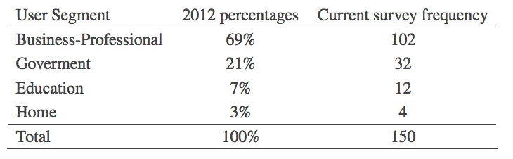

```{r setup, include=FALSE}
knitr::opts_chunk$set(echo = TRUE)
library(janitor)
```

## Quick Quiz

Answer:
A:Height
B: Age
C: Weight
D: Salary per year

## 2.1 Australian road fatalities
```{r}
library("tidyverse") # loads readr, dplyr, ggplot2, ...
bitre_link = "https://data.gov.au/data/dataset/5b530fb8-526e-4fbf-b0f6-aa24e84e4277/resource/fd646fdc-7788-4bea-a736-e4aeb0dd09a8/download/ardd_fatalities.csv"
# here's a link to a copy I took in case the above link dies.
# https://raw.githubusercontent.com/DATA2002/data/master/ardd_fatalities.csv
fdata = readr::read_csv(bitre_link)
# If you download the data file first and save it as FILE_NAME.csv
# and it is in the same folder, you can use:
# fdata = readr::read_csv("FILE_NAME.csv")
```
### Find me the unique states of this dataframe
```{r}
# head(fdata)
unique(as.vector(t(fdata["State"])))
```

## 2.2 Cereal
```{r}
cereal = readr::read_csv("https://github.com/DATA2002/data/raw/master/Cereal.csv", 
    na = "-1")
glimpse(cereal)
```
## 2.3 Hair and eye colour
```{r}
HairEyeColor
```

## 4 Exercises
### 4.1. Tablet devices

Notice how this has categorical data.
Q: Does the data provide sufficient evidence to indicate that the figures obtained in the current survey agree with the percentages in 2012?

Word evidence and cross-tabulation table suggests chi-square test. Our observed data is current survey frequency and our expected data is 2012 percentages. 

WTF: 2012 percentages into 2012 expected frequencies, so we can perform our chi-square test.

Null hypothesis: current survey data does agree with percentages in 2012.
Alternative: current survey data does not agree with percentages in 2012.


STEPS for chi-square test (Hypothesis testing steps):

1. State null and alternative hypothesis
2. Choose level of significance
3. Find critical value
4. Find test statistic
5. Draw your conclusion.

```{r}
# Observed frequencies

observed_frequencies = c(102, 32, 12, 4)
# Expected probabilities
expected_probabilities = c(0.69, 0.21, 0.07, 0.03)
n = sum(observed_frequencies)
expected_frequencies = n * expected_probabilities

e_table <- data.frame(User_Segment=c("Business-Professional","Government","Education","Home"),observed_frequencies,expected_probabilities,expected_frequencies)

e_table %>% adorn_totals()
# rbind(table, data.frame(User_Segment = "Total", t(colSums(table[, -1]))))
```
BUT we have a problem! In each cell of expected_frequencies, the expected frequency must be >= 5, but Home is only 4.5! So combine together to create revised table.
```{r}
# e_table[5,] <- c("hello", e_table[3,2:4] + e_table[4,2:4])
# e_table[5,]
# need to change to list as vector can contain only one datatype
a <- as.list(c("Education and Home", e_table[3,2:4] + e_table[4,2:4]))
e_table[3,] <- a
proper_table <- e_table[-c(4),]
proper_table
```
```{r}
obs <- proper_table[,2]
exp <-  proper_table[,4]
chi_test_statistic <- sum((obs - exp)^2/exp)
chi_test_statistic
```
Our degrees of freedom for this one column contingency table is df = k -1 = 3-1=2, so with 2 degrees of freedom, we find our critical value. 

```{r}
# To get critical value, use qchisq()
significance_level <- 0.05
df <- 2
critical_val <- qchisq(significance_level,df,lower.tail=FALSE)
chi_test_statistic > critical_val 
```
As chi_test_statistic is not greater than critical value, we do not reject the null hypothesis.
Alternative, method to finding 

```{r}
obs <- c(102, 32, 12 + 4)
exp_prob <- c(0.69, 0.21, 0.07 + 0.03)
chisq.test(obs,p=exp_prob)
## Find p value given our test statistic and degrees of freedom
pchisq(chi_test_statistic,2,lower.tail=FALSE)
```
As p-value > 0.05, we do not reject the null hypothesis. Hence, the current data is consistent with the distribution of tablet devices in 2012.

## 4.2 Smoking rates
Of 100 randomly selected patients, there are 44 nonsmokers, 24 current smokers, 13 tobacco chewers and 19 ex-smokers. Should the researcher revise his estimates? Use 0.01 level of significance.

Null Hypothesis: Should not revise his estimates
Alt Hypothesis: Research should revise his estimates
```{r}
obs_f_2 <- c(44,24,13,19)
expected_probs_2 <-  c(0.5, 0.2, 0.1, 0.2)
n = sum(obs_f_2)
exp_f = n * expected_probs_2
chisq.test(obs_f_2,p=expected_probs_2)
```
As p value > 0.01, we do not reject null hypothesis. The data is consistent with the proportions estimated by the researcher.

## Australian road fatalities

```{r}
bitre_link = "https://data.gov.au/data/dataset/5b530fb8-526e-4fbf-b0f6-aa24e84e4277/resource/fd646fdc-7788-4bea-a736-e4aeb0dd09a8/download/ardd_fatalities.csv"
fdata = readr::read_csv(bitre_link, na = "-9", guess_max = 1e6) %>% 
  janitor::clean_names()
# fdata
cdata = fdata %>% 
  select(-road_user, -gender, -age, -age_group) %>% 
  distinct()  %>% 
  # Here we create groups based on unique crash ids. Hence we have 2 groups, as crash_id 20164024 occurs twice, each in the group.
 group_by(crash_id) %>% slice(1) %>%
    ungroup() %>% 
  mutate(hour = lubridate::hour(time))
cdata
# slice(mtcars,1)
# mtcars
```


**1. How are missing values recorded, and why might they occur?**

The missing numeric values in the data set are denoted by ‘-9’. This might occur when police can not determine specific details about the fatality, such as the age of the killed person or the speed limit at the crash site. Text entries may contain ‘Unknown’ if police could not determine those details of the crash.

**2. How many fatalities occurred since 1989? How many fatal crashes have there been since 1989?**

When importing the data, note that we have specified the missing value identifier as na = "-9" and asked the read_csv() function to inspect more of the data than the default in order to guess the column types. We also cleaned the column names using the clean_names() function from the janitor package.

```{r}
bitre_link = "https://data.gov.au/data/dataset/5b530fb8-526e-4fbf-b0f6-aa24e84e4277/resource/fd646fdc-7788-4bea-a736-e4aeb0dd09a8/download/ardd_fatalities.csv"
fdata = readr::read_csv(bitre_link, na = "-9", guess_max = 1e+06)
fdata = janitor::clean_names(fdata)
# glimpse(fdata) 
##Get me a subset of year
b_df = subset(cdata,year==2020)
## Find the most common hour for fatalities in 2020
sort(table(b_df$hour),decreasing=TRUE)[1:4]

sort(table(b_df$month),decreasing=TRUE)

```
Each entry in this data set is a unique fatality, so we can count the number of fatalities by counting the number of rows: 51543. There may be more than one fatality per crash, so to identify the number of fatal crashes, we need to reduce the data frame removing individual specific data and then applying the distinct() function to keep only distinct rows:

```{r}
cdata = fdata %>% select(-road_user, -gender, -age, -age_group) %>% 
    distinct()
nrow(cdata)
cdata %>% select(crash_id) %>% n_distinct()
```

This is almost the same as checking to see how many distinct crash_id entries there are in the data set. There is one inconsistency where we have two rows in the crash data for the same crash ID:
```{r}
cdata %>% group_by(crash_id) %>% filter(n() > 1)
```


In this crash one fatality had a speed_limit of 100 while the other had a speed_limit of 60. This could be an error, or perhaps they were traveling on opposite sides of the road and the crash occurred near a change in the speed limit. Let’s just keep one of them by slicing the data:

```{r}
cdata = cdata %>% group_by(crash_id) %>% slice(1) %>% ungroup()
nrow(cdata)
```


**3. What is the most common hour of the day for a fatal crash?**

To work out the most common hour of the day for a fatal crash let’s work with the time column. We use thehour() function from the lubridate package to extract the hour from the time.

```{r}
cdata = cdata %>% mutate(hour = lubridate::hour(time))
```
We can now tabulate or visualise the hour column.
```{r}
cdata %>% ggplot() + aes(x = hour) + geom_bar()
```
We can see that the most common hour of the day for fatalities is 3pm. Does this necessarily mean that it is most dangerous to drive at 3pm?

**4. What is the most common day of the week for a fatal crash?**

```{r}
# cdata %>% count(dayweek)
cdata %>% ggplot() + aes(x = dayweek) + geom_bar()
```
Saturday is the most common day for fatal crashes. Note that the bar chart isn’t great because the days are in alphabetical order. Let’s fix that:

```{r}
df_2020 = subset(cdata,year==2020)
df_2020= df_2020 %>% mutate(dayweek = factor(dayweek, levels = c("Monday", 
    "Tuesday", "Wednesday", "Thursday", "Friday", "Saturday", "Sunday")))
# cdata %>% count(dayweek)
df_2020 %>% ggplot() + aes(x = dayweek) + geom_bar() + labs(y = "Number of fatalities", x = "")
```
It is now a lot easier to interpret the plot.


**5. What is the most common month for a fatal crash?**

```{r}
# cdata %>% count(month)
cdata %>% ggplot() + aes(x = month) + geom_bar()
```
Let’s create a nicer variable with month names rather than just numbers.
```{r}
cdata = cdata %>% mutate(month_named = factor(month, levels = 1:12, 
    labels = month.abb))
cdata %>% ggplot() + aes(x = month_named) + geom_bar() + labs(y = "Number of fatalities", 
    x = "")
```

**6. Are fatal crashes uniformly distributed across the months of the year? Filter the data down to one year (e.g. 2019) to do this test. You should write out a full hypothesis test and make an appropriate conclusion.** 

```{r}
mcount = cdata %>% filter(year == 2019) %>% dplyr::count(month_named)
mcount
```
To test if fatal crashes are uniformly distributed across the months of the year:

1. H0:p1=p2=p3,…,p12=112 vs H1: At least one of the equalities does not hold.
2. Assumption: ei=npi≥5
```{r}
mcount = mcount %>% mutate(expected = (1/12) * sum(n))
mcount$expected >= 5
```
3. Calculate the chi-test statistic.
```{r}
(Tstat = sum(((mcount$n - mcount$expected)^2)/mcount$expected))
```
4. Observed test statistic: t0= 9.34.
5. p-value: P(x_squared≥ 9.34) = 0.59.
```{r}
(pv = 1 - pchisq(Tstat, df = 11))
```
6. Decision: Since the p-value is quite large (p = 0.59), we do not reject the null hypothesis at the 5% level of significance. We conclude that there is no significant difference between the number of fatal crashes across the months of the year hence the observed pattern of crashes are consistent with the hypothesis of a uniform distribution across the months of the year.

We could also do it using chisq.test()
```{r}
chisq.test(mcount$n)
```


 


