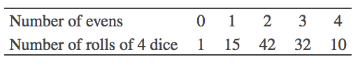
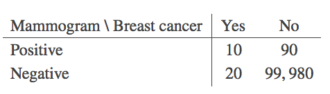
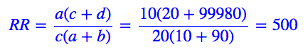
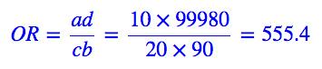
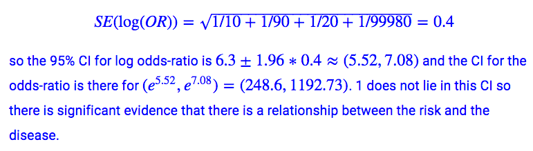

```{r setup, include=FALSE}
knitr::opts_chunk$set(echo = TRUE)
```

## Quick quiz

**An appropriate test to see whether the proportion of births for DATA2002 students is 0.25 for each of the 4 seasons is:**

a. **Chi-squared goodness of fit test**

Reason: There are 1 categorical variable(seasons:4 types;summer,autumn,winter,spring) and 1 population variable. If there we 2 or more population variables, this would be a chi-square test of independence.

b. Chi-squared test of independence
c. Test if the correlation coefficient is significantly different to zero
d. Check if the CI for the log odds ratio contains 1

**In a test to see whether the proportion of births for DATA2002 students is 0.25 for each of the 4 seasons, assuming that the null hypothesis is true, the distribution of the test statistic is:**

a. **chi-squared with 3 degrees of freedom χ2**
b. chi-squared with 4 degrees of freedom χ2
c. standard normal Z∼N(0,1)
d. t distribution with 3 degrees of freedom t3
e. t distribution with 4 degrees of freedom t4

**A casino is worried about whether or not its die have been tampered with. To test this, a dealer rolls 4 dice 100 times and records the number of evens (2, 4 or 6) that appear.**


**What distribution does the test statistic for a chi-squared goodness of fit follow in this example?**
a. chi-squared with 1 degree of freedom 
b. chi-squared with 2 degrees of freedom 
c. chi-squared with 3 degrees of freedom 
d. **chi-squared with 4 degrees of freedom**
Reason: as goodness of fit test, we use df = k-1 =5-1 = 4. We didn’t need to estimate any parameters, so our chi-squared test degrees of freedom is the number of categories minus 1. Also don’t need to collapse any categories, because the expected cell counts will all be greater than 5, but this is shown later on. Can check it pretty easily by considering the probability of getting no evens (or all evens) as (1/2)^4 = 1/16 and then multiplying that by 100 to get the smallest expected cell count of 100/16=6.25.

Note: yes, we see 0 number of evens is 1, but we only combine together categories when our expected cells contain a frequency less than 5. 

e. chi-squared with 5 degrees of freedom 

**Goals per soccer game arrive at random moments, and could be reasonably modelled by a Poisson process. If so, the total number of goals scored in a soccer game should be a Poisson random variable. Here are the number of goals scored in each of the n=104 Fifa world cup games in 2015**
```{r}
goals <- c(1, 0, 0, 1, 1, 0, 0, 0, 1, 1, 2, 2, 4, 0, 10, 0, 1, 1, 
    2, 3, 0, 4, 1, 3, 6, 0, 1, 0, 10, 1, 2, 1, 0, 1, 1, 2, 3, 3, 3, 
    1, 2, 0, 0, 0, 0, 1, 1, 1, 1, 1, 2, 0, 1, 0, 2, 2, 0, 1, 2, 1, 
    1, 0, 1, 1, 0, 2, 2, 1, 0, 5, 2, 1, 4, 1, 1, 0, 0, 1, 3, 0, 1, 
    0, 1, 2, 2, 0, 2, 1, 1, 1, 0, 1, 0, 1, 2, 1, 2, 0, 2, 1, 0, 1, 
    5, 2)
observed_goals = table(goals)
observed_goals
```
We can fit a Poisson random variable with mean parameter lamda calculated as (hence, we estimate lambda, need to remove one degrees of freedom):
```{r}
(lambda = mean(goals))
```
And work out the expected cell counts as follows:
```{r}
# dpois is our probability density function = PMF. B.S. stat contains this equation. Returns a vector of our PDF
# ppois shows the probability of having
expected_goals = 104 * c(dpois(0:9, lambda), ppois(9, lambda, lower.tail = FALSE))
round(expected_goals, 2)
expected_goals[-(1:4)]
```
**How many degrees of freedom do we have?**

Notice, how some of our expected frequency cells are less than 5, this means we have to combine them so that all expected frequency cell counts >= 5. We collapse the last 7 columns, so we have 5 left over. Using DF formula, df = 5 -1 -1 (from estimated lambda) = 3.


## 2 Group exercise
**1. What are the key differences between prospective and retrospective study?**
**2. What are relative risks? What are odds-ratios?**
**3. Why would you use one over the other?**

## 3 Exercises
### 3.1. Dishonest dice

A casino is worried about whether or not its die have been tampered with. To test this, a dealer rolls 4 dice 100 times and records how many even numbers (2, 4 or 6) appear.


Can the scientist infer at the 5% significance level that the number of even when n=4 dice are rolled follows a binomial random variable with p=1/2? USE CHI-SQUARE TEST

```{r}
library(ggplot2)
y = c(1, 15, 42, 32, 10)  # input the observed counts
x = 0:4  # define the corresponding groups 
probability = 0.5
# Find expected frequency based on cell counts
prob_bin <- dbinom(x,4,0.5)
## just a binomial graph
# ggplot(data.frame(x,yp), aes(x=x, y = yp))  + geom_col()

expected_f <- 100*yp
expected_f
chisq.test(y, p=prob_bin)
```
As p-value < 0.05, we reject the null hypothesis and say that the dices are not honest.
Use:
qchisq(alpha,df,lower.tail=FALSE) returns critical value on upper tail of curve. 

This is a sensible conclusion as the data were actually generated using:
```{r}
set.seed(10)
y = table(rbinom(100,4,0.55))
```
Note, in an exam, you might be given some R code such as this:
```{r}
qchisq(c(0.01, 0.025, 0.05, 0.1, 0.9, 0.95, 0.975, 0.99), 4)
```
The above means for 0.01 significance level (the 1% probability of rejecting the null hypothesis when null hypothesis is true), 0.025 signance level (the 2.5% probability of rejecting the null hypothesis when null hypothesis is true) and so on, with 4 degrees of freedom. Note: left tail, so the above outputs critical values.  If the test statistic is greater than the upper-tail critical value or less than the lower-tail critical value, we reject the null hypothesis.


### 3.2. Mammograms
Suppose that among 100,000 women with negative mammograms, 20 will have breast cancer diagnosed within 2 years; and among 100 women with positive mammograms, 10 will have breast cancer diagnosed within 2 years. Clinicians would like to know if there is a relationship between a positive or negative mammogram and developing breast cancer?


```{r}
x = matrix(c(10, 20, 90, 99980), ncol = 2)
colnames(x) = c("Breast cancer: yes", "Breast cancer: no")
rownames(x) = c("Mammogram: positive", "Mammogram: negative")
```

1. **Is it appropriate to use a relative risk to quantify the relationship between the risk factor (Mammogram result) and disease (Breast cancer)? If so calculate the relative risk.**

It is appropriate to use relative risk here as the study is prospective in nature. The participants were enrolled by risk factor (mammogram) and not the disease (breast cancer).



This is very far from 1. Women with a positive mammogram are 500 times more likely to develop breast cancer than women with a negative mammogram.

```{r}
# install.packages('mosaic')
mosaic::relrisk(x)
```


2. **Calculate the odds of having breast cancer for positive vs negative mammograms.**
The odds of developing breast cancer after a positive vs negative mammogram are


```{r}
mosaic::oddsRatio(x)
```


3. **Calculate a confidence interval for the odds-ratio, is there evidence that there might be a relationship between mammogram test results and breast cancer diagnosis?**

```{r}
se = sqrt(1/10 + 1/90 + 1/20 + 1/99980)
or = (10 * 99980)/(20 * 90)
log_ci = c(log(or) - qnorm(0.975) * se, log(or) + qnorm(0.975) * se)
ci = exp(log_ci)
```
Using the mosaic package:
```{r}
mosaic::oddsRatio(x, verbose = TRUE)
```
To get the same results as our manual calculations, we need to switch the columns:
```{r}
y = x[, c(2, 1)]
mosaic::oddsRatio(y, verbose = TRUE)
```


### 3.3. Education
This dataset measures the educational attainment of Americans by age categories in 1984. Counts are presented in thousands. Data collected by the U.S. Bureau of the Census. Americans under age 25 are not included because many have not completed their education. The variables are:

1. Education: Level of education achieved
2. Age_Group: Age group (years)
3. Count: 1000’s of Americans in this education and age category

Read in the data and check the size of your data. Think about what the number of rows actually means.
```{r}
## Reading in the data
library("tidyverse")
edu = readr::read_delim("https://raw.githubusercontent.com/DATA2002/data/master/education-by-age-census.txt", 
    delim = "\t")
edu = edu %>% janitor::clean_names()
knitr::kable(edu)
```
We can summarise this data in a more “human friendly” format using the tidyr::spread() function:
```{r}
edu %>% tidyr::spread(key = age_group, value = count)
# an alternative approach is the xtabs function xtabs(count ~
# education + age_group, data = edu)
```
Note that the categories aren’t in a sensible order, let’s reorder (relevel) them. To do this we’ll use the forcats package that is part of the tidyverse.
```{r}
edu = edu %>% 
  dplyr::mutate(
    age_group = forcats::fct_relevel(age_group, ">64", after = 4),
    education = forcats::fct_relevel(education, 
                                     "Did not complete high school", 
                                     "Completed high school", 
                                     "College,1-3 years", 
                                     "College,4 or more years"))
tab = edu %>% tidyr::spread(key = age_group, value = count)
# tab = xtabs(count ~ education + age_group, data = edu)
tab
```
Many of the questions below are about college vs non-college. Let’s add in a new variable in our data frame that identifies the college vs non-college categories.

```{r}
edu = edu %>% mutate(college = dplyr::if_else(stringr::str_detect(education, 
    "College"), "College", "No college"))
```
And let’s make a aggregated data frame edu_college that summarises over the different education levels, leaving totals for the college variable
```{r}
edu_college = edu %>% dplyr::group_by(age_group, college) %>% dplyr::summarise(count = sum(count)) %>% 
    dplyr::ungroup()
```
1. **Which age category has the highest percentage of college graduates?**
If we’re practicing our tidyverse ninja skills,
```{r}
edu_college %>% group_by(age_group) %>% mutate(pct_in_age_grp = round(count/sum(count), 2) * 100) %>% arrange(college, age_group)
```
Alternatively using the tab object, we can identify the rows of interest, sum down those columns and divide those by the column totals:
```{r}
tab
colSums(tab[3:4, -1])/colSums(tab[, -1])
```
**Ans: age group 35-44 with 66%**

2. **What percent of all Americans over age 25 never went to college?**
```{r}
edu_college %>% group_by(college) %>% summarise(count = sum(count)) %>% 
    mutate(pct = count/sum(count))
x = rowSums(tab[, -1])
sum(x[1:2]/sum(x))
```
**ANS: 62%**

3. Based on this data, is there evidence of a relationship between age category and educational attainment? In other words, is there evidence that younger people are more likely to have finished college than older people? Use graphical representation to compare the percent of people in each age group who have completed college. What is the appropriate statistical test to use here?

```{r}
## Using education on the x-axis
ggplot(edu, aes(x = education, y = count, fill = age_group)) + geom_bar(stat = "identity", 
    position = position_dodge())
```

```{r}
## Examine proportion within each population instead of counts.
ggplot(edu, aes(x = education, y = count, fill = age_group)) + geom_bar(stat = "identity", 
    position = "fill")
```

```{r}
## Limit to look at the category 'finished college'
ggplot(edu_college, aes(x = college, y = count, fill = age_group)) + 
    geom_bar(stat = "identity", position = position_dodge())
```
```{r}
## Examine proportion within each population instead of counts.
ggplot(edu_college, aes(x = college, y = count, fill = age_group)) + 
    geom_bar(stat = "identity", position = "fill")
```

This is census data, there is no sampling and hence no statistical test is appropriate (i.e. no chi-square test).


